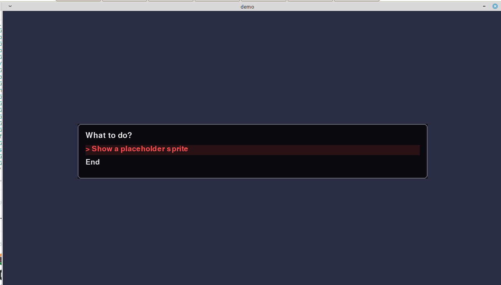

# cpyvn

A minimal, script-first visual novel engine in Python 3.11+ using pygame (SDL2).



## Docs

- Website: `https://bymehul.github.io/cpyvn/`
- Local docs: `docs/`
- Command reference: `docs/commands/`

## Quick Start

### Linux / macOS

```bash
python3 -m venv .venv
source .venv/bin/activate
pip install -r requirements.txt
python setup_cython.py build_ext --inplace
python main.py --project games/demo
```

### Windows (PowerShell)

```powershell
py -m venv .venv
.venv\Scripts\Activate.ps1
pip install -r requirements.txt
python setup_cython.py build_ext --inplace
python main.py --project games/demo
```

### Windows (CMD)

```bat
py -m venv .venv
.venv\Scripts\activate.bat
pip install -r requirements.txt
python setup_cython.py build_ext --inplace
python main.py --project games/demo
```

- Standard script extension: `.cvn` (CpyVN).
- Cython build is required for this repo.
- You need a C compiler (`gcc`/`clang`/Visual Studio Build Tools).
- Optional video backend (`vnef-video`) details: `docs/commands/video.md`.
- Export guide (engine + game): `docs/export.md`.
- Studio GUI (new game + export): `docs/studio.md`.
- Optional WGPU blur notes: `docs/wgpu_blur.md`.
- Full memory model: `docs/memory.md`.
- Enable debug logs with `"debug": true`, `--debug`, or `CPYVN_DEBUG=1`.
- Auto loading for `call` is configurable in `project.json` under `ui`:
  - `call_auto_loading`
  - `call_loading_text`
  - `call_loading_threshold_ms`
  - `call_loading_min_show_ms`

## Minimal Script Example

```cvn
label start:
    scene color #2b2d42 fade 0.4;
    narrator "Welcome to cpyvn.";
    ask "What to do?"
        "Show a sprite" -> show_demo
        "End" -> end;

label show_demo:
    add image alice "alice.png" 820 220;
    narrator "Sprite on screen.";
    off alice;
    go end;

label end:
    scene color #1b263b;
    narrator "Thanks for trying cpyvn.";
```

## Controls

- Advance: `Space`, `Enter`, `Left Mouse`
- Choice: `Up/Down` to select, `Enter` to confirm
- Quicksave: `F5`
- Quickload: `F9`
- Pause menu: `Esc` (Resume / Save / Load / Preferences / Quit)
- Title menu: configurable startup menu via `ui.title_menu_file`
- Inspector: `F3`
- Hotspot editor: `F4`
- Script editor: `F6`

Pause menu theme/layout can be customized per project with `ui.pause_menu_file`
(example: `games/demo/pause_menu.json`).
Title menu theme/layout can be customized with `ui.title_menu_file`
(example: `games/demo/title_menu.json`).
`title_menu.json` supports custom logo image blocks.
